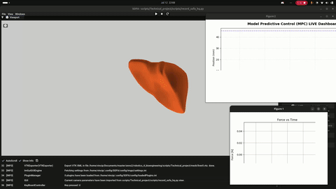
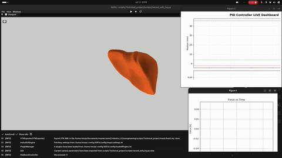

# Concentric Tube Robot (CTR) SOFA Simulation

This repository contains a comprehensive simulation environment for a 2-instrument Concentric Tube Robot (CTR) developed using the [SOFA framework](https://www.sofa-framework.org/). It provides a realistic, physics-based simulation of the CTR interacting with soft tissue (a liver model) and features a variety of advanced control strategies.

## Setup and Usage

### Prerequisites
- [SOFA Framework](https://www.sofa-framework.org/) (v25.06 or similar compatible version) with Python 3 support enabled.
- Required Python packages: `numpy`, `scipy`, `matplotlib`

### Running the Simulation

You can launch the simulation using the `runSofa` executable provided by your SOFA installation:

```bash
/path/to/SOFA/bin/runSofa 2instruments.py
```

If U want a more aesthetics simulation use:
```bash
/path/to/SOFA/bin/runSofa  /scripts/record_sofa_hq.py
```

### Controls (Keyboard Teleoperation)
When the Keyboard Controller is active, the following controls can be used to manually drive the CTR:
- **`1` / `2`**: Select which tube to control (1 = Catheter, 2 = Guide).
- **`W` / `S`**: Translate (insert/retract) the selected tube.
- **`A` / `D`**: Rotate the selected tube clockwise/counter-clockwise.

### Autonomous controllers
The following controllers are available:
- **`P`**: PID (with snapping avoidance and null-space projection)
- **`C`**: MPC (with force constraints and shared-mode)

## Videos

### MPC Controller (with Dual-Mode & Force Constraints)


### PID Controller (with Follow-The-Leader & Null-Space Projection)


## Project Structure

- **`2instruments.py`**: The main simulation script. It constructs the SOFA scene, configures the two concentric tubes (Catheter and Guide), sets up collision models, and initializes the selected controller. It also handles loading the interactive FEM liver or gracefully falling back to a static `liver0.vtu` mesh for collision testing.
- **`src/`**: Contains the core logic and controllers:
  - **`teleoperation.py`**: Implements a Keyboard Controller for manual, teleoperated manipulation of the tubes.
  - **`PIDController.py`**: A sophisticated 3D position controller utilizing a Damped Least Squares (DLS) analytical Jacobian. It employs Null-Space Projection for secondary tasks including Follow-The-Leader (FTL) telescopic coordination and S-Divergence Snapping Avoidance.
  - **`MPCController.py`**: Implements a 4-DOF Model Predictive Control (MPC) using SLSQP optimization. It coordinates independent tube deployment, handles collision forces, and features a Dual-Mode (Shared) controller that switches to a local DLS Proportional Controller near the target to prevent limit cycles.
  - **`AdaptiveController.py`**: Contains advanced controllers, including a 4-DOF MIMO MCS Adaptive Controller utilizing relative insertion state representations to safely decouple and control the highly nonlinear tube dynamics.
  - **`liver.py`**: Handles the generation of a volumetric mesh of a liver from a surface mesh, represented as an elastic object for realistic interaction with the CTR.
  - **`telemetry.py`**: Provides the foundational classes and Mixins for generating the real-time Matplotlib tracking dashboards used across the controllers.
  - **`workspace_generator.py`**: A feedforward controller that systematically explores the configuration space using physics-aware sampling to compute the CTR's reachable workspace.
  - **`setup.py`**: Utility functions to load SOFA plugins and tube parameters from configuration files.
- **`scripts/`**: Utilities for post-processing and simulation management:
  - **`plot_workspace.py` / `plot_graphs.py`**: Utilities for data visualization and path planning plotting.
  - **`record_sofa_hq.py`**: Utility for high-quality simulation rendering and screen recording configurations.
- **`config/`**: Contains configuration files such as `tube_parameters.json` which define physical properties (lengths, radii, curvature) for the tubes.
- **`mesh/`**: Contains 3D mesh files (e.g., `liver.obj`) used in the simulation environment.
- **`workspace/` / `Workspace images/` / `SOFA captures/` / `images/`**: Directories for generated data, plots, and visual captures from the simulation.

## Features

- **Physics-Based Simulation**: Accurately models the kinematics and mechanics of concentric tube robots using SOFA's beam models (`AdaptiveBeamForceFieldAndMass`, `Edge2QuadTopologicalMapping`, etc.).
- **Soft Tissue Interaction**: Includes a volumetric liver model with adjustable stiffness (Young's modulus) to simulate contact and interactions.
- **Advanced Control Strategies**: *not fully tested* Evaluate and compare tracking performance using Teleoperation, PID (with snapping avoidance and null-space projection), MPC (with force constraints), MRAC, and MCS controllers.
- **Real-Time Dashboards**: Live matplotlib-based dashboards integrated into the SOFA simulation loop for monitoring target tracking, errors, and actuator inputs.
- **Workspace Generation**: Automated scripts to compute and visualize the reachable workspace of the robot configuration.


## Configuration

Physical parameters of the tubes can be modified in `config/tube_parameters.json`. This includes:
- `Straight_length`
- `Curved_length`
- `Tube_radius`
- `Radius_curvature`


